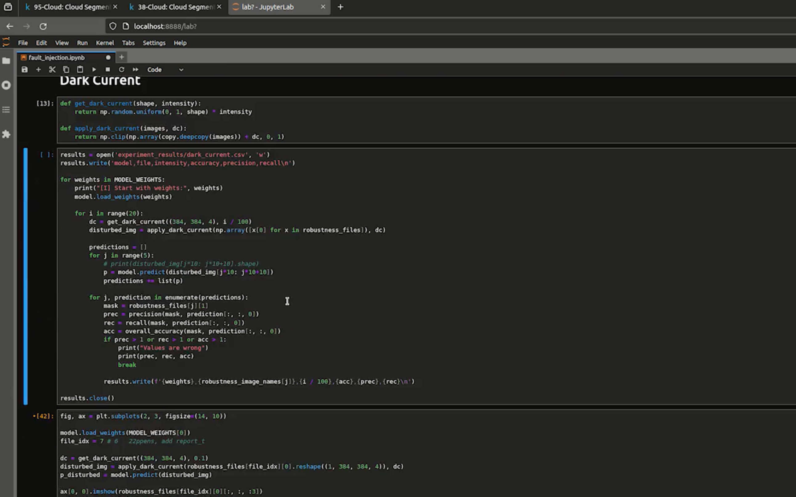

# spacesec24_robustness

Dear Reviewers,

this GitHub repository describes the artifacts of the paper *"Machine Learning in Space: Towards Assessing the Robustness of on-board ML models to Radiation"*. You will get an overview about all created plots and figures and have access to the code used for executing the experiments reported in our paper. In addition, we state which data was used for training and validation the models but also for the experiments itself.

# Demonstrative Video

We show the whole process of installation, setup and how to use our code in a short demonstrative video.

[](assets/demonstrative_video.mp4)

# Structure

The project consists of several folders:

- `UNet`: Here the main implementation of the UNet itself, but also the script for training a network can be found.
- `train`: In this folder, all training data used by the UNet is located and devided into input and gt. Input corresponds to the image which will be given as input into the neural network whereas gt the ground truth of the image is.
- `validation`: Similar like the training folder but it contains only images and their ground truth for instances used as validation data.
- `robustnesstest`: Here the images are given that were used for conducting the experiments described in the paper (and implemented in the `fault_injection.ipynb` notebook).
- `models`: After the training is completed, the model and the log file of the model will be saved to this folder. From here, it can be loaded later on for executing the experiments.
- `assets`: When running the cells within the notebook `fault_injection.ipynb`, the images and diagrams will be saved to this folder.
- `experiment_results`: This folder contains all results from the experiments about image disturbances as csv files.
- `results`: In this folder, the results of the bit-flip injection campaign can be found for each model.

In addition to the given folder structure, several scripts and files are also available in the root directory of this repository:

- `requirements.txt`: This file specifies all requirements needed to start running the code in this project.
- `fault_injection.ipynb`: The notebook used for implementing all the fault injection of image disturbances and bit-flips into the models of the neural network.
- `fault_injection_results.ipynb`: This notebook takes the data from the bit-flip injection campaign and creates the diagrams for the influence of bit-flips used in the paper.
- `create_data.py`: The script is used for the preprocessing of the downloaded data. It takes the images from the source directory, combines the individual channels into single images and moves them into the respective folders for training and testing.

# Setup

For setting up the project we created a `requirements.txt` which contains all used dependencies. We strongly recommend creating a virtual environment using conda first (with Python 3.10). This step helped in a later stage with setting up the dependencies for CUDA. After setting up the conda environment you can install it using:

```bash
pip install -r requirements.txt
```

Please make sure that all the dependencies are set up correctly and that the installation specifically from TensorFlow (and CUDA) worked without problems.

# How to get the data

We are using the 95-Cloud dataset which is available as a splitted dataset (e. g. one dataset with 38 instances and the second with 57) and can be downloaded from Kaggle:

- [Download 95-Cloud Dataset](https://www.kaggle.com/datasets/sorour/95cloud-cloud-segmentation-on-satellite-images)
- [Download 38-Cloud Dataset](https://www.kaggle.com/datasets/sorour/38cloud-cloud-segmentation-in-satellite-images)

For further information, please also see [95-Cloud-An-Extension-to-38-Cloud-Dataset](https://github.com/SorourMo/95-Cloud-An-Extension-to-38-Cloud-Dataset).

# Prepare Data for Training

The downloaded data is given as one tif file per channel and image. To merge the different files together and create one image per file, the script `create_data.py` is used. It takes both, the path to the 38-Cloud and 95-Cloud dataset but also the csv files to the training and validation image names. Per default, the train folder of the 38-Cloud dataset after download is *38-Cloud_training* and of 95-Cloud it is *95-cloud_training_only_additional_to38-cloud*. To start the script, you can run the following command:
```bash
python create_data.py \
       --dataset-38cloud /path/to/38-cloud/38-Cloud_training \
       --dataset-39cloud /path/to/95-cloud/95-cloud_training_only_additional_to38-cloud \
       --train-images ./train/image_names_training.csv \
       --validation-images ./validation/image_names_validation.csv
```

Please note that we published the used training and validation images in the folders `train` and `validation`. The arguments `train-images` and `validation-images` therefore will stay unchanged. For the paths to the 38-Cloud and 95-Cloud dataset, please use the foldername of the training folder, which is located within the root folder of the downloaded dataset.

# Training the models

You can start the training process by executing the script `train_models.sh` inside of the `UNet` folder. This script iterates three times and calles the script `main.py` which trains always a single model based on the given training and validation data. All models are then written to the folder `models` inside of the root directory of this repository. Please note that for each trained model a new folder is created. This folder increases its number always by one (starting from 1) until an available folder name was found. For starting the script, use the following commands:

```bash
cd UNet  # Enter the UNet folder (Necessary so that all paths fit)

bash ./train_models.sh  # Start the training process of three models
```

# Starting the experiments

For starting the experiments, you can now open the notebook `fault_injection.ipynb` and execute the code in the different cells. This will first load the models and the data, assess the performance and then inject faults into the images. At the end, an injection campaign will be started that injects 19 800 faults into 50 images. This will result in 990 000 observations of how bit-flips will change the performance of neural networks.
